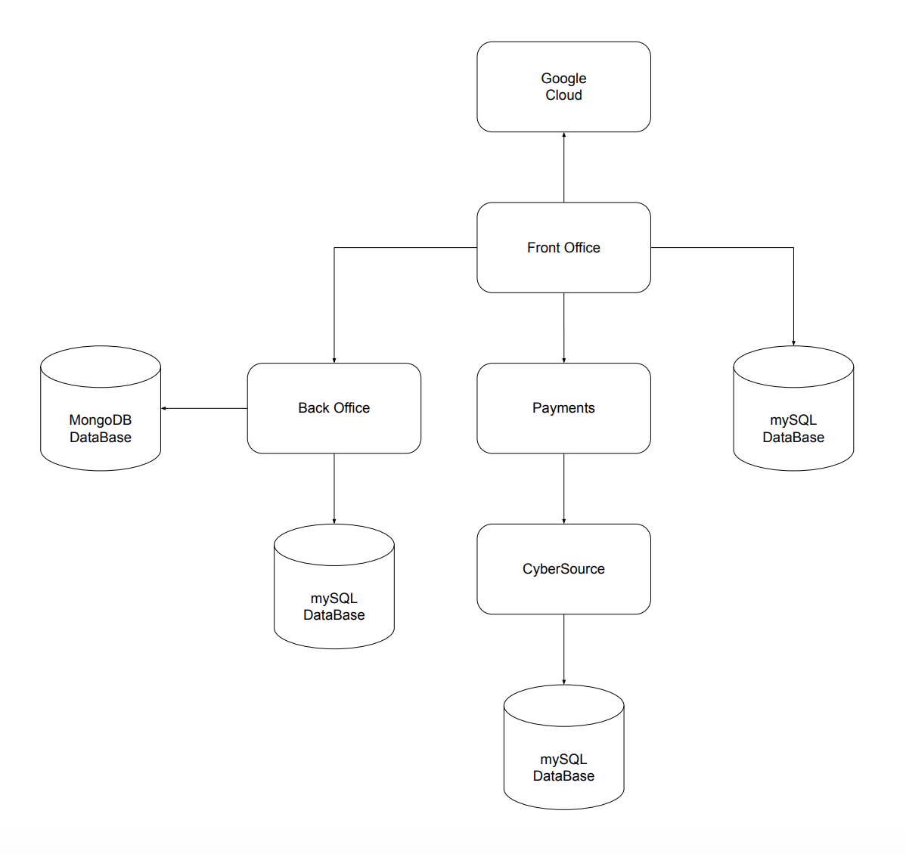
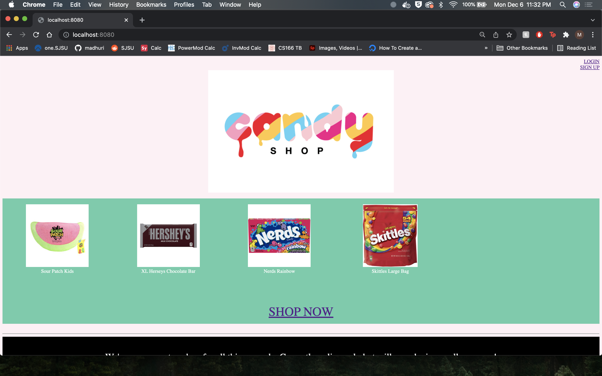
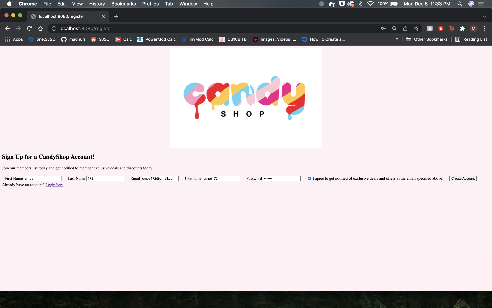
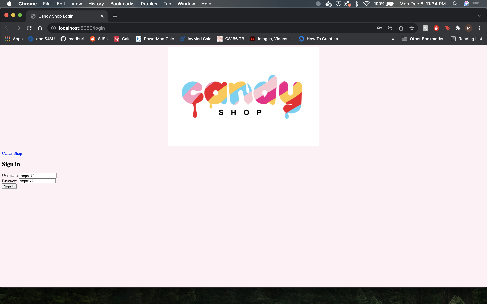
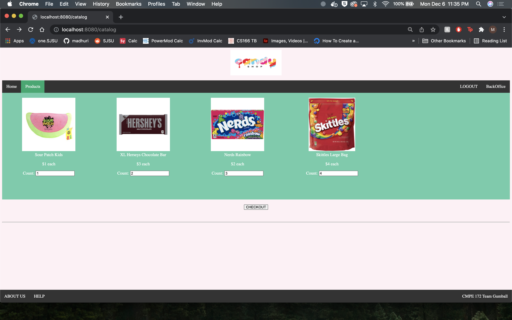
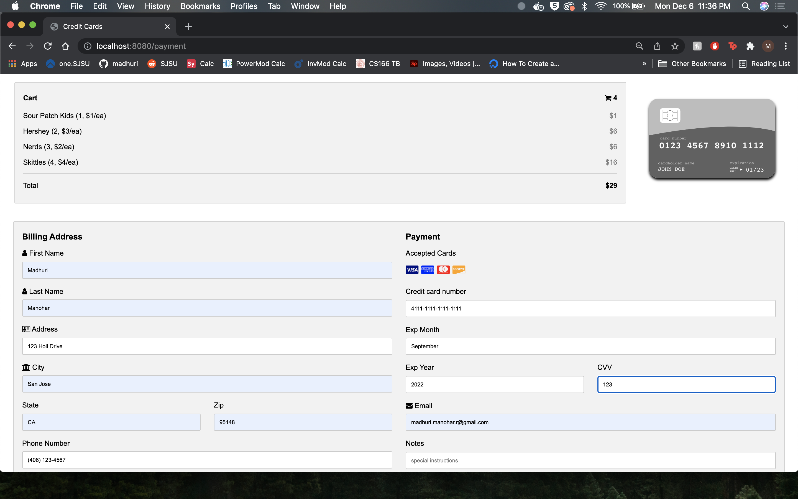
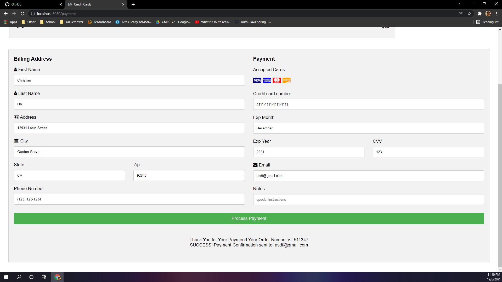
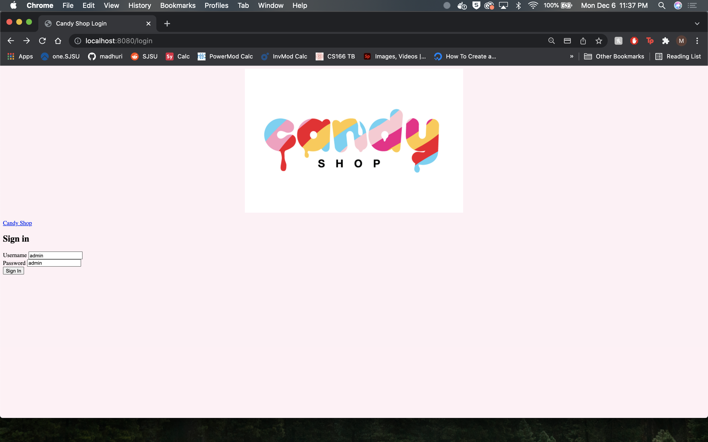
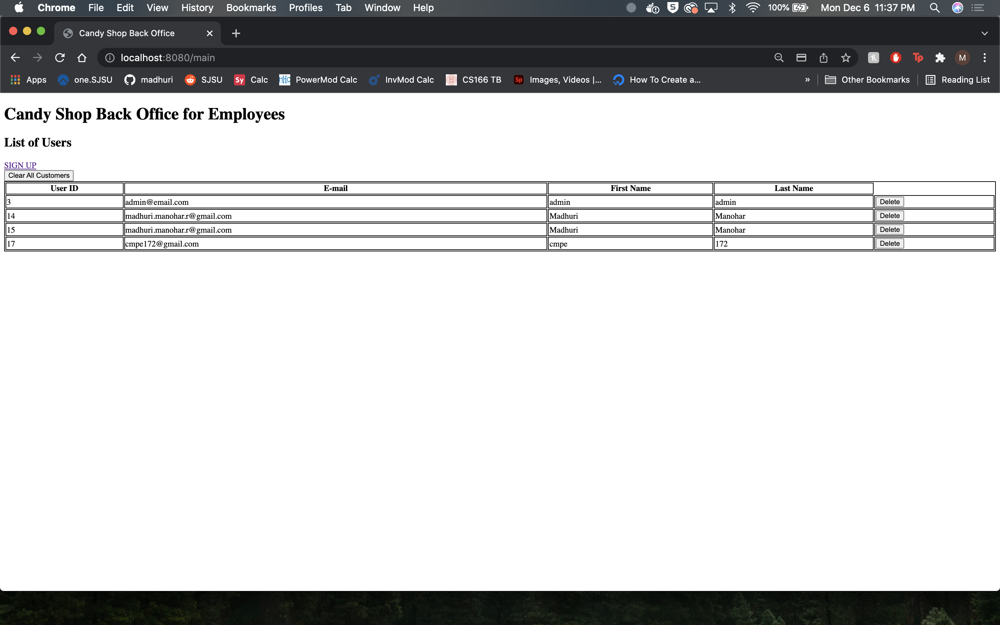

# Team Gumball

## Project Members

Gurteg Singh, Cameron Lau, Madhuri Manohar, Christian Oh

## Project Description

Team Gumball created a Candy Shop where customers can login/sign up and select candy from our shop, add it to cart, cheackout and make payments. For more details about the backend, look at our diagrams.

Four seniors got together to build this candy shop from ground up. We put in our blood, sweat and tears to make this dream of ours a reality. Please support our small business! Hope you enjoy!

## Setup for our Candy Shop Application

### Docker

Start up Docker Desktop and have the MySql container running.

```bash
docker run -d --name mysql -td -p 3306:3306 -e MYSQL_ROOT_PASSWORD=welcome mysql:8.0
```

### MySQL

On terminal, run the following commands.

- The mysql username = admin
- the password = welcome
- the database = cmpe172
- the table = users

```bash
$ docker exec -it mysql bash
```

```bash
/# mysql --password
Enter password:
```

```bash
  create database cmpe172;
```

```bash
  USE cmpe172;
```

```bash
  create user 'admin'@'%' identified by 'welcome';
```

```bash
  grant all on cmpe172.* to 'admin'@'%';
```

```bash
  select * from users;
```

For our admin login to the candy shop, we need to insert an ADMIN_ROLE into the mySQL Database. To do this run the following command in the mysql shell.

```bash
INSERT INTO users(id, email, firstname, lastname, password, roles, username) VALUES(1, 'admin@email.com','admin','admin','admin','ROLE_ADMIN','admin');
```

### MongoDB

To access the Mongo Database, download MongoDB Compass.

To get started with MongoDB, run the following commands on your terminal.

```bash
  sudo pip3 install mysql-connector
```

```bash
  sudo pip3 install mysql-connector-python
```

```bash
  sudo pip3 install pymongo
```

## Diagrams/Images



## Requirements

### Functional Requirements

- Front Office Portal
  - User can register for an account.
  - User can login/sign out of their account.
  - User can navigate/browse through our candy shop products.
  - User can process their desired order.
  - User can pay for their order.
- Back Office Portal
  - Admin role exists for employees ONLY.
  - Admins can manually create/add a customer into the database.
  - Admins can manually delete a single customer or delete all customers from the database.
- Integration with CyberSource Payments
  - Customer can add items to their cart, checkout and finalize their purchase/payment.

### Software Stack and Tools

- Used Spring Framework(Spring MVC, Spring JP, etc.) for the whole project.
- The front office portal utalizes front end technologies like HTML and CSS.
- The development tools that were used were:
  - all the builds were done with Gradle 5.6
  - the version of Java should be JDK 11
- The database and middleware requirements used were mySQL DataBase 8.0 and RabbitMQ.
- Credit card payments were done with integrating through CyberSouce Payment Gateway.

### Extra Credit

- We explored other GCP features and services like Cloud SQL
- We explored using MongoDB in our project.

## Demo/Screenshots

This is the landing page for our Candy Shop application.



This is the sign up page for our Candy Shop application.



This is the login page for our Candy Shop application.



This is the products page for our Candy Shop application.



This is the checkout page for our Candy Shop application.



This is the confirmation that the payment went to cybersource.



This is the rabbits queue after a successful payments


This is the specific admin login for our Candy Shop application.



This is the back office page that shows the customer database for our Candy Shop application.



## Team Journal

### Journal Entry 1 (Week 1: 11/08 - 11/15)

- The team met to discuss what application to make.
- Created a mock outline of the application design.
- Split up work to research more about how to incorporate all the tools and technologies.

### Journal Entry 2 (Week 2: 11/15 - 11/22)

- The team met to discuss progress in research.
- Assigned roles and specific tasks to each person.

### Journal Entry 3 (Week 3: 11/22 - 11/29)

- Revised application design and architecture.
- Got started on implentation.
- Created front office page, got started with login and sign up forms for customers.

### Journal Entry 4 (Week 4: 11/29 - 12/6)

- The team met up every day to work on the project together.
- Completed the final implemenation of the project.
- Tested each other's code and collaborated.
