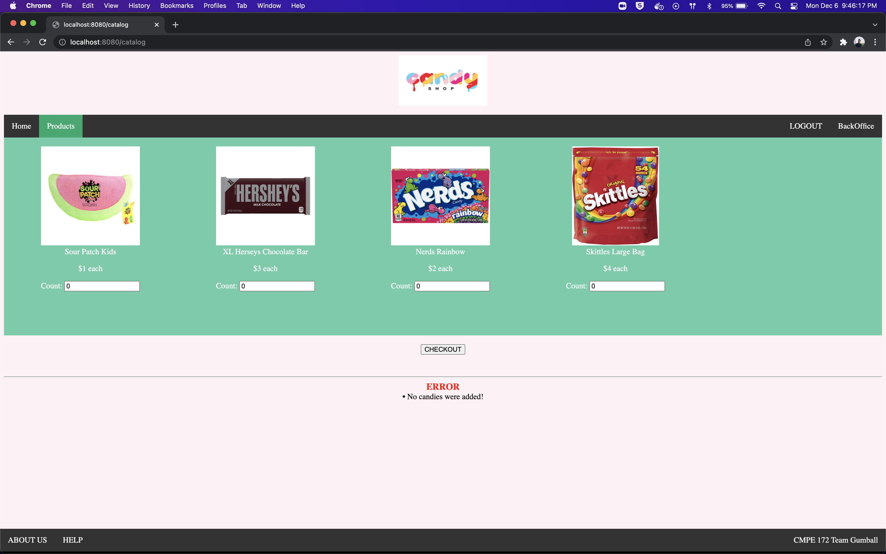
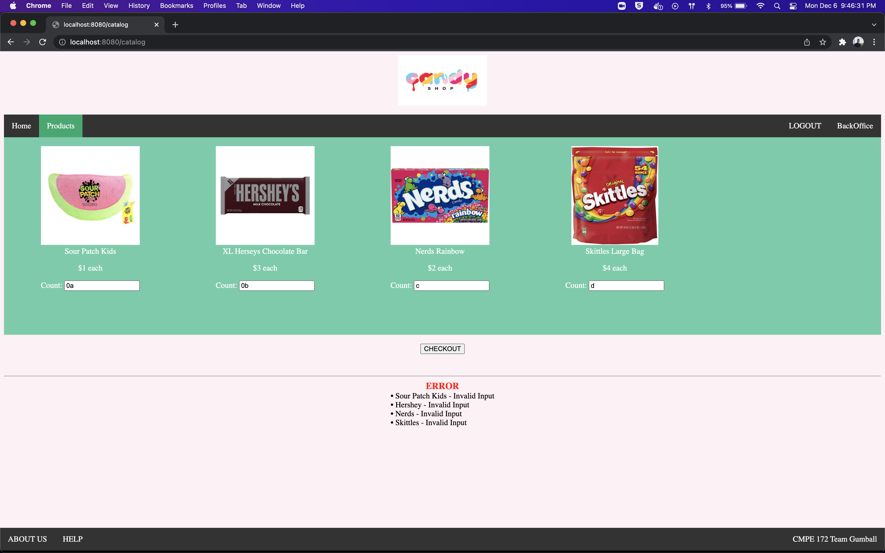
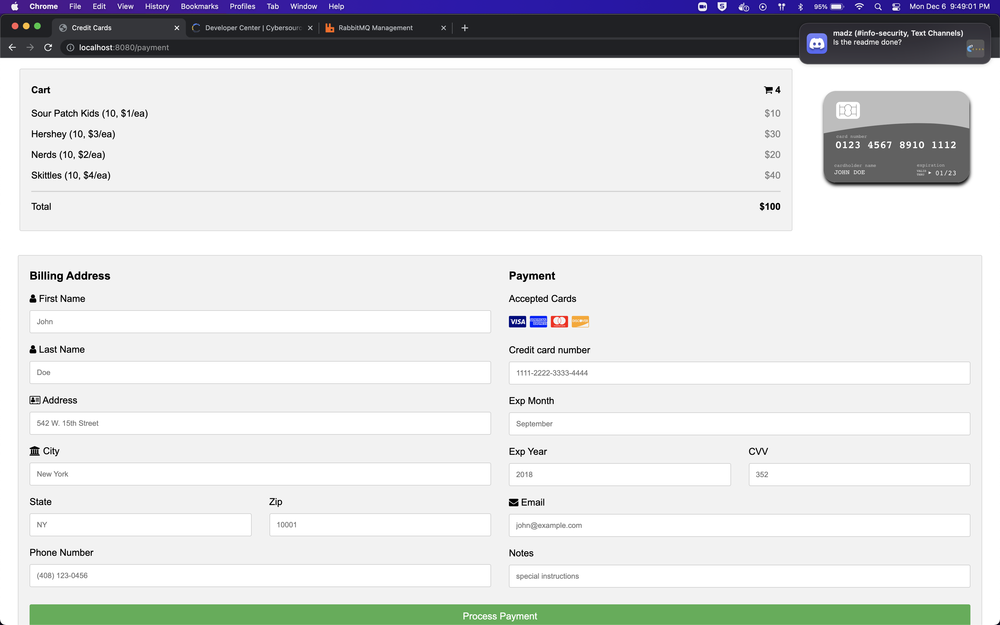
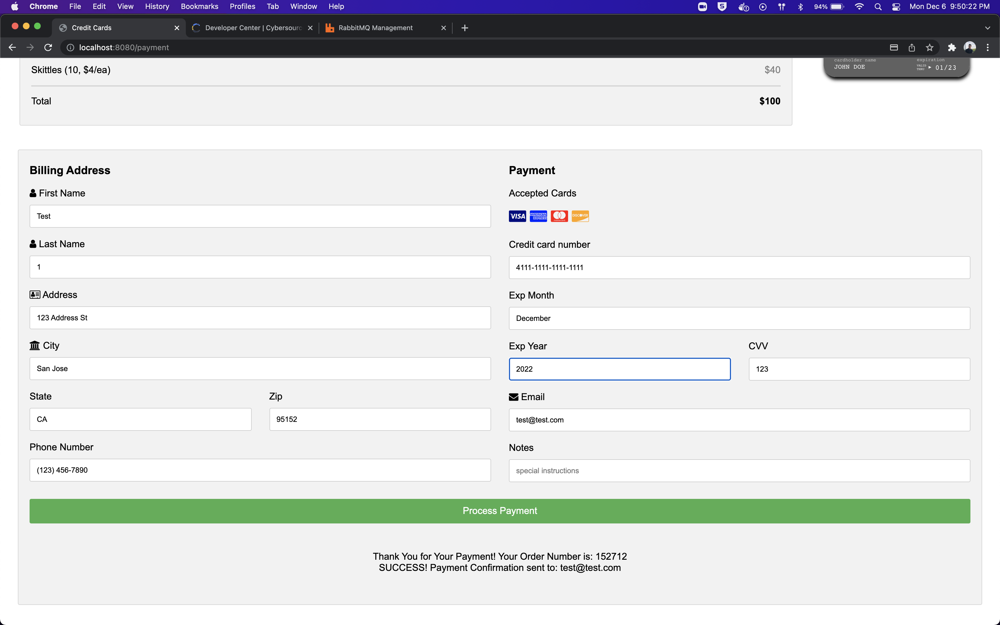
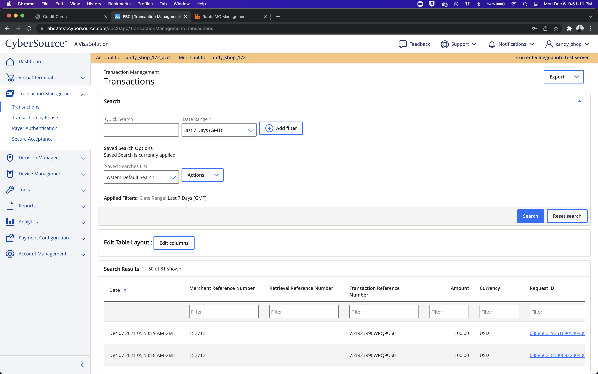
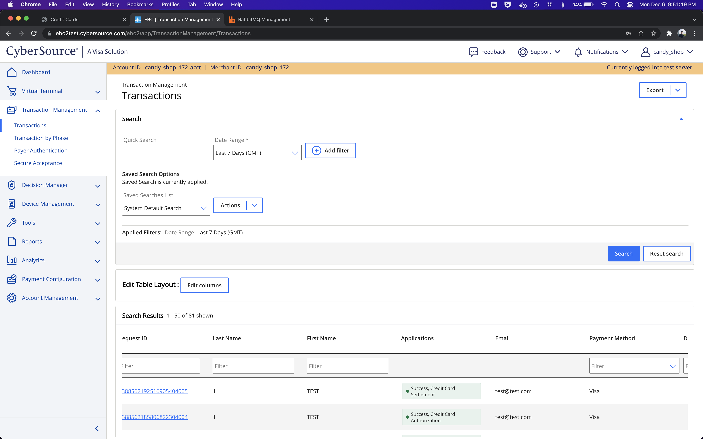
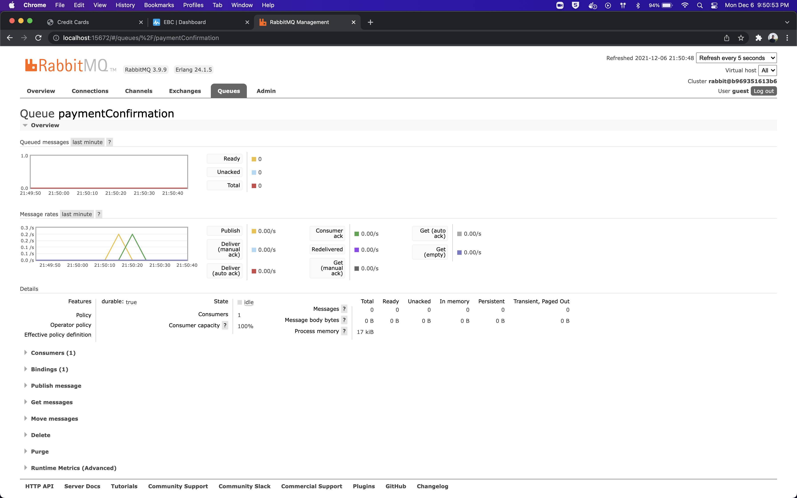

# Cameron Lau Journal

## Week 1

- I met up with the team to discuss what application we wanted to implement.
- Together, we created a rough outline of what our application design would look like.
- Lastly, we split up work in order to provide each member time to research their features.

## Week 2

- We met in person to discuss our progress and readiness for the project.
- Began designing roles and tasks to each group member.

## Week 3

- Revised application design and architecture.
- Worked on the catalog page connecting to the payments page:

- Worked on data validations and displaying the correct error message(s):

    - No candies selected before checking out:

    

    - Non-numbers in the input fields:

    

- Assisted via pair programming in some of the backoffice development.

## Week 4

- Worked on the payments page, showcasing data gathered from the catalog page:

- HTML page with filled inputs and success messages at the bottom:

- Connected payments page to CyberSource:

- Worked on implementing rabbitMQ locally:
    - The email inputted in the payment form is sent to the RabbitMQ queue, and once it is read it is showed in the success message at the bottom.

- Attempted to work on re-structuring the project to support a microservices design, along with trying to get the application deployed on GKE. 
