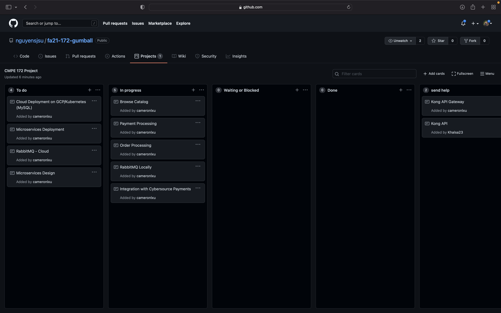
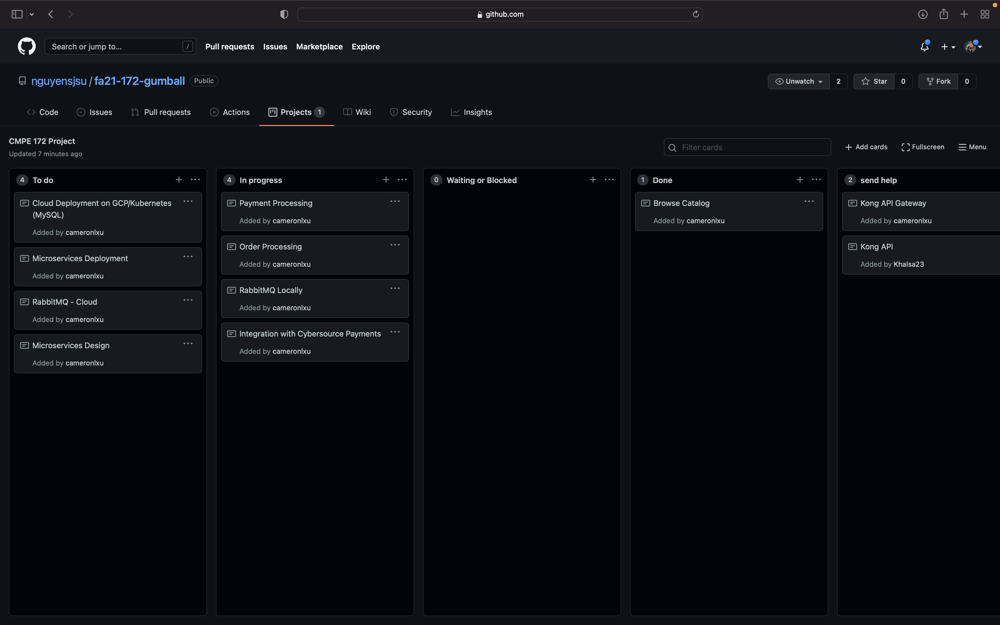
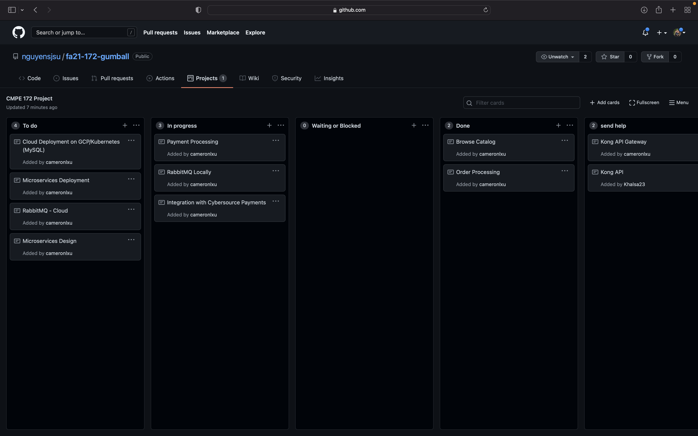
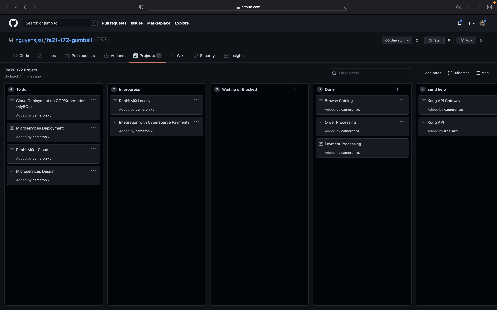
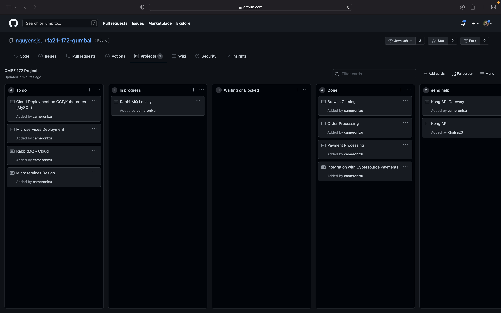
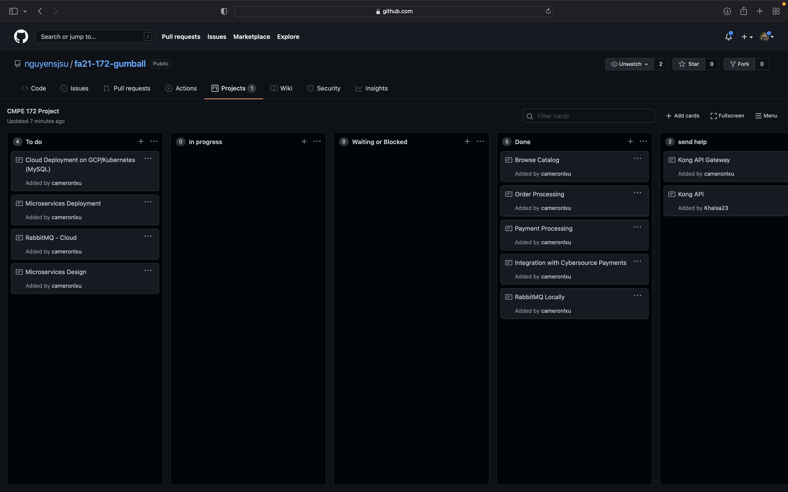

# Cameron Lau Journal

## Week 1

### Kanban Board
- Nothing for this week.

### Progress
- I met up with the team to discuss what application we wanted to implement.
- Together, we created a rough outline of what our application design would look like.
- Lastly, we split up work in order to provide each member time to research their features.

### Challenges
- No challenges this week as we started the planning phase.

## Week 2

### Kanban Board
- Nothing for this week.

### Progress
- We met in person to discuss our progress and readiness for the project.
- Began designing roles and tasks to each group member.

### Challenges
- No challenges this week as we were still planning.

## Week 3

### Kanban Board

### Progress
- Revised application design and architecture.
- Worked on the catalog page connecting to the payments page:

- Worked on data validations and displaying the correct error message(s):

    - No candies selected before checking out:

    

    - Non-numbers in the input fields:

    

- Assisted via pair programming in some of the backoffice development.

### Commits
- [Commit - Creating the project](https://github.com/nguyensjsu/fa21-172-gumball/commit/9ba5a8f9fe24bc5a3f107b8f092212abb8f0c584)

### Challenges
- Having to learn spring boot and thymeleaf more closely was a challenge as I ran into many bugs trying to pass the same model object/values between different pages and controllers. 
- Having to learn the different request mappings to be able to call a function, also to keep track of data validation

## Week 4

### Kanban Board

### Progress
- Worked on the payments page, showcasing data gathered from the catalog page:

- HTML page with filled inputs and success messages at the bottom:

- Connected payments page to CyberSource:

- Worked on implementing rabbitMQ locally:
    - The email inputted in the payment form is sent to the RabbitMQ queue, and once it is read it is showed in the success message at the bottom.

### Commits
- [Commit - Update Catalog, Payments page and connect CyberSource](https://github.com/nguyensjsu/fa21-172-gumball/commit/b5902aa323622b1fb16d4e4ebd478dd3ed913c09)
- [Commit - RabbitMQ](https://github.com/nguyensjsu/fa21-172-gumball/commit/ab2c4e3871bcdcd8b8762182a52b9756a130a527)
- [Commit - Fixing bugs](https://github.com/nguyensjsu/fa21-172-gumball/commit/6c75abbe2a66b870fad4d37b891da6e3e91919a7)

### Challenges
- Learning about RabbitMQ, its use cases, and how it can be implemented to where it can be called programmatically rather than via the command line (lab 9)
- After many features were added, I attempted to work on re-structuring the project to support a microservices design, along with trying to get the application deployed on GKE. Not having created the different projects prior to this made it difficult to restructure the application without something breaking.
