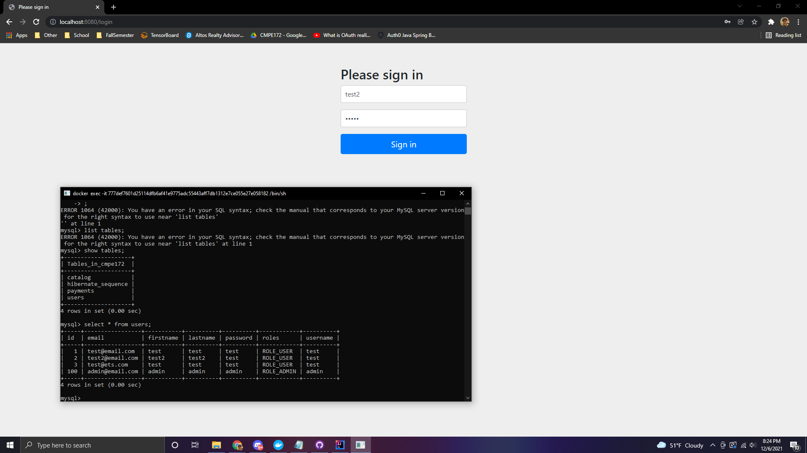
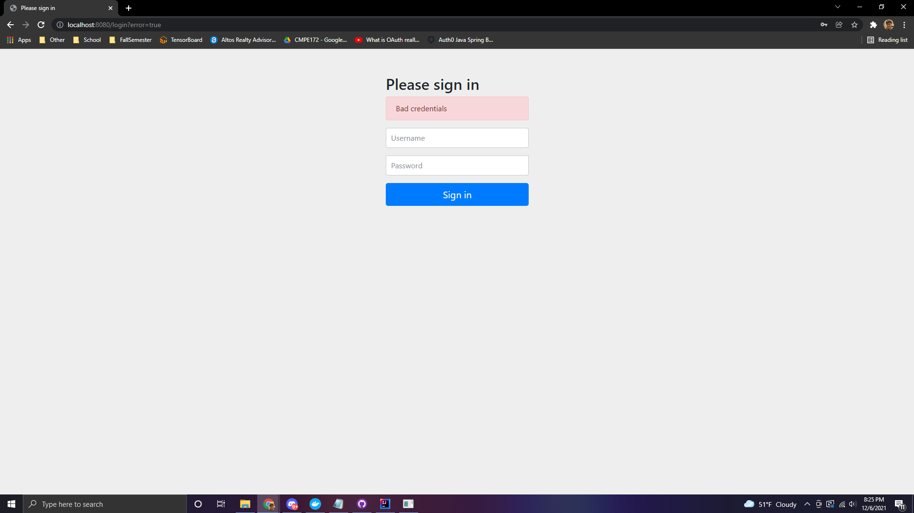
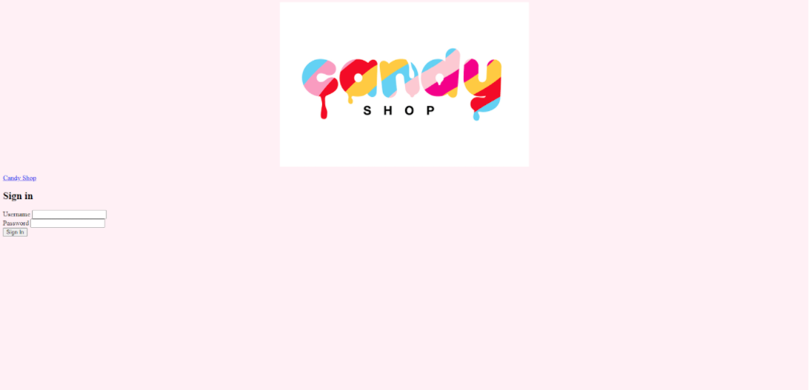
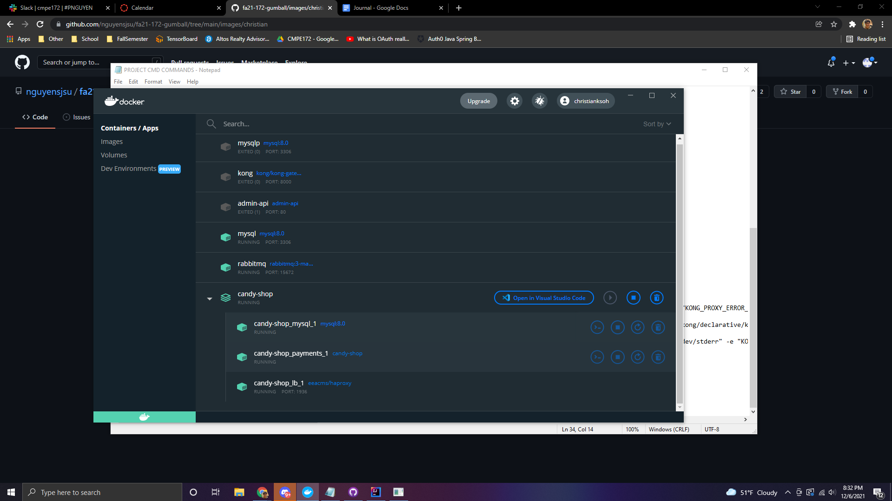

# Christian Journal

## Week 1

 - Team met to discuss what application to make.
 - Discussed outline and mock designs

## Week 2

- Met again and decided on what type of store to build
- Assigned roles and tasks to each person

## Week 3

- Started working on the project and heped with the login security
- Deleted the login html page temporarily to test the autogenerated login page provided by spring security

- Then reimplimented the login page to work with security config, myuserdetails, and myuserdetailservice

## Week 4

- Created the docker-compose to create container with mysql, springapp, and load balancer

- Created a new Kong Branch to start working on splitting applicatoin into microservices
- Split cyper payments, backoffice, and front end parts

Create RestControllers in the microservices; however couldn't get anything to connect.
