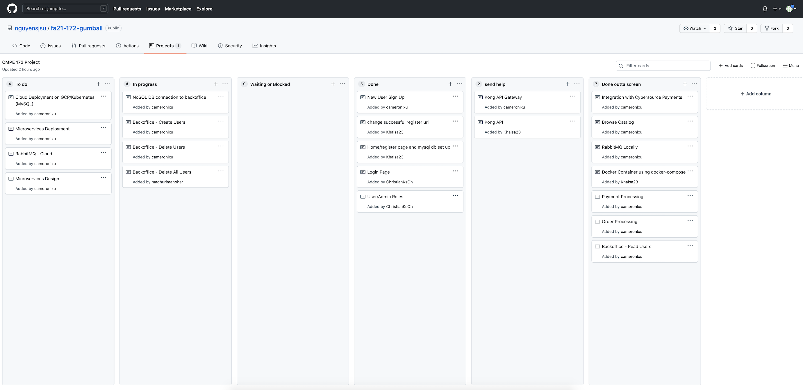

# Madhuri's Weekly Journal

## Week 1 (11/08 - 11/15)

I met with the rest of the team and we all discussed what kind of application we wanted to make. We created an outline of the kind of design structure that we wanted to go with. This meeting left me off with a good overview of what I expected to do for this project.

## Week 2 (11/15 - 11/22)

We had another meeting this week where we figured out the specifics of the project application and how we're going to connect all the software together. We assigned roles and continued with our research.

## Week 3 (11/22 - 11/29)

I was beginning to get started with the back office portal code. I looked into what I would need to implement to get this working, and also how to connect and integrate it with other portions of the project.

## Week 4 (11/29 - 12/6)

My team and I worked on getting the implementation done for this project. I worked on developing the back office portal which allows admins or employees to delete any customer from the mySQL database, manually create new customer login details and dump or delete the entire database consisting of all the customer login details.

I also worked on integrating MongoDB with our project. This is an add on functionality to the back office portal. Admins can run a command that allows them to copy over all the data from mySQL to MongoDB. This works using a Python script.

I faced many challenges during this project. A lot of times my code would break and it would be a small issue like the wrong verison that I would have to find and fix. Also, learning how to use MongoDB in a short amount of time was pretty challenging for me.

1. The images below show the progress of my code through the project cards.

2. Commits

   1. https://github.com/nguyensjsu/fa21-172-gumball/commit/f509e95e043e7bece00cff663087fd23b353c6b9
   2. https://github.com/nguyensjsu/fa21-172-gumball/commit/2e0b6145c190ca2c5145a21fd332c795d0dcdce1
   3. https://github.com/nguyensjsu/fa21-172-gumball/commit/e2c2e446316949243888e9ab1be0d871376a4c05
   4. https://github.com/nguyensjsu/fa21-172-gumball/commit/cf23b7115e10e448fc13404487493e859a9d0c6e

3. The images below shows progress of the code.

